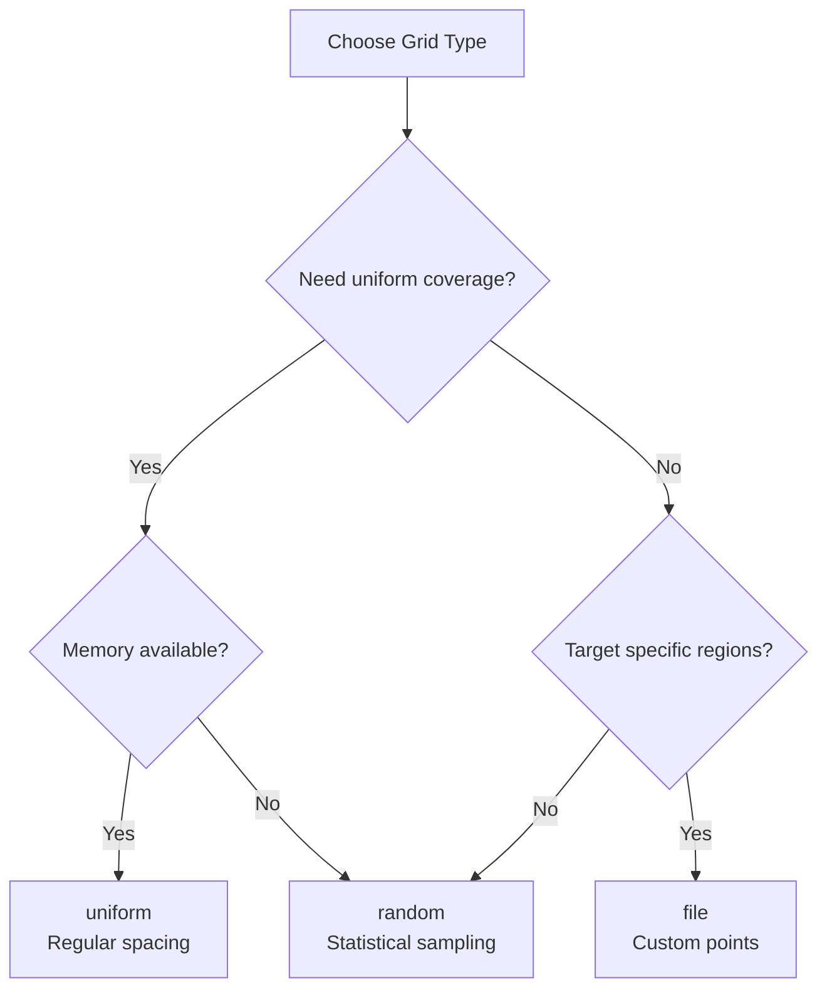

# Gridding

Detailed guide to grid point generation modes and their use cases.

## Overview

The gridder supports three methods for creating grid points where overdensities are calculated:

| Type | Description | Use Case | Memory | Speed |
|------|-------------|----------|--------|-------|
| **uniform** | Regular cubic lattice | Dense sampling, maps | High | Fast |
| **random** | Monte Carlo sampling | Statistics, sparse sampling | Medium | Fast |
| **file** | Custom coordinates | Targeted regions, halos | Variable | Medium |

## Uniform Grids

### Description

Creates a regular cubic lattice of grid points uniformly spanning the simulation volume.

### Configuration

```yaml
Grid:
  type: uniform
  cdim: 100  # Grid points per dimension
```

Creates `cdim × cdim × cdim` total grid points.

### Grid Structure

Points are placed at:

$$
\mathbf{r}_{i,j,k} = \left( \frac{i + 0.5}{N}, \frac{j + 0.5}{N}, \frac{k + 0.5}{N} \right) \times L_{\rm box}
$$

where:

- $i, j, k \in [0, N-1]$ are grid indices
- $N$ = `cdim`
- $L_{\rm box}$ = simulation box size
- Points are cell-centered (offset by 0.5)

### Examples

=== "Low Resolution (Quick Test)"

    ```yaml
    Grid:
      type: uniform
      cdim: 50  # 125,000 points
    ```

    - Grid spacing: $L_{\rm box} / 50$
    - Memory: ~10 MB
    - Use for: Quick tests, prototyping

=== "Medium Resolution (Standard)"

    ```yaml
    Grid:
      type: uniform
      cdim: 100  # 1,000,000 points
    ```

    - Grid spacing: $L_{\rm box} / 100$
    - Memory: ~80 MB
    - Use for: General analysis, intermediate maps

=== "High Resolution (Production)"

    ```yaml
    Grid:
      type: uniform
      cdim: 200  # 8,000,000 points
    ```

    - Grid spacing: $L_{\rm box} / 200$
    - Memory: ~640 MB
    - Use for: Detailed maps, high-resolution analysis

=== "Very High Resolution (HPC)"

    ```yaml
    Grid:
      type: uniform
      cdim: 500  # 125,000,000 points
    ```

    - Grid spacing: $L_{\rm box} / 500$
    - Memory: ~10 GB
    - Use for: Ultra-high resolution, MPI required

### Resolution Selection

Choose `cdim` based on science requirements:

**Nyquist Sampling:**

For kernel radius $R$:

$$
\Delta x \leq R \quad \Rightarrow \quad {\rm cdim} \geq \frac{L_{\rm box}}{R}
$$

**Example:**

- Box size: 50 Mpc/h
- Kernel radius: 1.0 Mpc/h
- Minimum cdim: 50

**Recommended:** Use 2-3× Nyquist for well-sampled fields:

```yaml
# Box = 50 Mpc/h, kernel = 1.0 Mpc/h
# Nyquist: cdim = 50
# Recommended: cdim = 100-150
Grid:
  cdim: 100
```

### Memory Scaling

Memory requirements (approximate):

```
Points = cdim³
Memory ≈ Points × (64 + 24 × nkernels) bytes
```

**Examples (5 kernels):**

| cdim | Points | Memory |
|------|--------|--------|
| 50 | 125k | 20 MB |
| 100 | 1M | 150 MB |
| 200 | 8M | 1.2 GB |
| 300 | 27M | 4 GB |
| 500 | 125M | 19 GB |

### Advantages

- ✅ Uniform coverage of simulation volume
- ✅ Regular spacing ideal for FFTs, filtering
- ✅ Predictable memory usage
- ✅ Fast generation
- ✅ Easy visualization (3D arrays)

### Disadvantages

- ❌ Memory intensive for high resolution
- ❌ Samples low-density regions equally (inefficient)
- ❌ Fixed resolution everywhere
- ❌ Grid artifacts in power spectra

### Best For

- Creating density field maps
- Uniform sampling requirements
- FFT-based post-processing
- Visual rendering
- Machine learning training data

---

## Random Grids

### Description

Randomly distributed grid points using uniform sampling from the simulation volume.

### Configuration

```yaml
Grid:
  type: random
  n_grid_points: 1000000  # Total number of points
```

### Distribution

Points are generated with:

$$
\mathbf{r}_i = (x_i, y_i, z_i), \quad x_i, y_i, z_i \sim \mathcal{U}(0, L_{\rm box})
$$

where $\mathcal{U}$ is the uniform distribution.

**Random Number Generator:** Mersenne Twister MT19937 (reproducible with same seed)

### Examples

=== "Sparse Sampling"

    ```yaml
    Grid:
      type: random
      n_grid_points: 100000  # 100k points
    ```

    - Average spacing: $(V / N)^{1/3}$
    - Use for: Quick statistics, correlation functions

=== "Medium Sampling"

    ```yaml
    Grid:
      type: random
      n_grid_points: 1000000  # 1M points
    ```

    - Good balance of coverage and cost
    - Use for: PDF estimation, general statistics

=== "Dense Sampling"

    ```yaml
    Grid:
      type: random
      n_grid_points: 10000000  # 10M points
    ```

    - Near-uniform coverage
    - Use for: High-fidelity statistical analysis

### Comparison to Uniform

For equivalent coverage:

```
Uniform: cdim³ points with spacing Δx = L_box / cdim
Random:  N points with average spacing (L_box³ / N)^(1/3)
```

**Equivalent densities:**

| Uniform | Random |
|---------|--------|
| cdim=50 (125k) | N=125k |
| cdim=100 (1M) | N=1M |
| cdim=200 (8M) | N=8M |

**Memory advantage:** Random grids can achieve similar statistics with fewer points by avoiding over-sampling.

### Advantages

- ✅ No grid artifacts in power spectra
- ✅ Flexible point count (not constrained to cubes)
- ✅ Efficient for sparse sampling
- ✅ Good for statistical analysis
- ✅ Adaptable density (weight by local properties)

### Disadvantages

- ❌ Non-uniform coverage (clustering noise)
- ❌ Harder to visualize as maps
- ❌ No regular structure for FFTs
- ❌ Potentially poor sampling in low-density regions

### Best For

- Statistical measurements (PDFs, correlation functions)
- Avoiding systematic errors from regular grids
- Memory-constrained situations
- Quick exploratory analysis
- Regions where uniform sampling is wasteful

### Seed Control

The random seed is currently fixed (0) for reproducibility. To change:

```cpp
// In construct_grid_points.cpp
std::mt19937 gen(0);  // Change this for different realizations
```

Future versions may expose seed as parameter.

---

## File-Based Grids

### Description

Load grid point coordinates from a text file, enabling targeted sampling of specific regions.

### Configuration

```yaml
Grid:
  type: file
  grid_file: /path/to/grid_points.txt
```

### File Format

Simple whitespace-delimited text file:

```
# Comments start with #
# Format: x y z (comoving Mpc/h, one point per line)
10.5 20.3 15.7
25.0 30.0 35.0
12.1 18.9 22.3

# Empty lines and whitespace are ignored

30.5 35.2 40.1
```

**Coordinate System:**

- Same units as simulation (typically comoving Mpc/h)
- Origin at box corner (0, 0, 0)
- Must be within simulation boundaries

**Validation:**

Points outside the simulation box are automatically excluded with a warning:

```
Warning: Grid point (150.0, 25.0, 30.0) is outside simulation box (100.0³)
```

### Placeholder Support

Grid file paths support snapshot number replacement:

```yaml
Input:
  placeholder: "0000"

Grid:
  type: file
  grid_file: /data/grids/grid_points_0000.txt
```

Command: `./parent_gridder params.yml 8 42`

Actual file: `/data/grids/grid_points_0042.txt`

### Examples

=== "Halo Centers"

    Sample at locations of dark matter halos:

    ```python
    # Python script to generate halo center grid
    import h5py
    import numpy as np

    # Read halo catalog
    with h5py.File('halo_catalog_0042.hdf5', 'r') as f:
        positions = f['Halos/Coordinates'][:]
        masses = f['Halos/Mass'][:]

    # Select massive halos
    mask = masses > 1e12  # > 10^12 Msun
    halo_positions = positions[mask]

    # Write grid file
    with open('halo_centers_0042.txt', 'w') as f:
        f.write("# Halo centers for snapshot 42\n")
        f.write("# x y z (comoving Mpc/h)\n")
        for pos in halo_positions:
            f.write(f"{pos[0]:.6f} {pos[1]:.6f} {pos[2]:.6f}\n")
    ```

    Parameter file:
    ```yaml
    Grid:
      type: file
      grid_file: halo_centers_0042.txt
    ```

=== "Specific Slice"

    Sample only a thin slice through the box:

    ```python
    # Create grid points in a slice at z=50 Mpc/h
    import numpy as np

    # Grid in x-y plane at fixed z
    nx, ny = 100, 100
    z_slice = 50.0

    with open('slice_z50.txt', 'w') as f:
        f.write("# Slice at z=50 Mpc/h\n")
        for i in range(nx):
            for j in range(ny):
                x = (i + 0.5) * 100.0 / nx
                y = (j + 0.5) * 100.0 / ny
                f.write(f"{x:.4f} {y:.4f} {z_slice:.4f}\n")
    ```

=== "Void Centers"

    Sample in low-density regions:

    ```python
    # Identify and sample void centers
    # (requires void-finding algorithm)

    void_centers = find_voids(snapshot)  # Your void finder

    with open('void_centers.txt', 'w') as f:
        f.write("# Void centers\n")
        for center in void_centers:
            f.write(f"{center[0]} {center[1]} {center[2]}\n")
    ```

=== "Pencil Beam"

    Sample along a line of sight:

    ```python
    # Create points along a pencil beam
    n_points = 1000
    x0, y0 = 50.0, 50.0  # Fixed x, y
    z_min, z_max = 0.0, 100.0

    with open('pencil_beam.txt', 'w') as f:
        f.write("# Pencil beam through box center\n")
        for i in range(n_points):
            z = z_min + (z_max - z_min) * (i + 0.5) / n_points
            f.write(f"{x0} {y0} {z:.4f}\n")
    ```

### Generation Tools

**From Halo Catalogs:**

```python
import h5py

def extract_halo_positions(halo_file, output_file, min_mass=1e11):
    """Extract halo positions to grid file"""
    with h5py.File(halo_file, 'r') as f:
        pos = f['Halos/Coordinates'][:]
        mass = f['Halos/Mass'][:]

    mask = mass > min_mass
    selected_pos = pos[mask]

    with open(output_file, 'w') as f:
        f.write(f"# Halo positions (M > {min_mass:.1e} Msun)\n")
        for p in selected_pos:
            f.write(f"{p[0]:.6f} {p[1]:.6f} {p[2]:.6f}\n")

    print(f"Wrote {len(selected_pos)} halo positions")
```

**From Density Field:**

```python
import numpy as np

def sample_overdense_regions(density_field, threshold, box_size):
    """Sample points in overdense regions"""
    overdense = density_field > threshold
    indices = np.argwhere(overdense)

    # Convert indices to coordinates
    grid_points = (indices + 0.5) / density_field.shape[0] * box_size

    np.savetxt('overdense_regions.txt', grid_points,
               header='Overdense region centers',
               fmt='%.6f')
```

### Advantages

- ✅ Complete control over sampling
- ✅ Target specific regions of interest
- ✅ Adaptable point density
- ✅ Reuse same points across snapshots
- ✅ Can use external analysis (halo finders, etc.)

### Disadvantages

- ❌ Requires external grid generation
- ❌ No automatic coverage
- ❌ File I/O overhead
- ❌ Must validate points are in box

### Best For

- Targeted analysis (halos, voids, clusters)
- Following specific structures over time
- Custom sampling strategies
- Integrating with external pipelines
- Low-density sparse sampling

---

## Grid Comparison

### Performance

| Grid Type | Generation Time | Memory | Search Time |
|-----------|----------------|--------|-------------|
| uniform (cdim=100) | Fast (ms) | High | Fast |
| random (1M) | Fast (ms) | Medium | Fast |
| file (1M) | Medium (I/O) | Medium | Fast |

**Search time** (finding particles in kernels) is similar for all types - dominated by octree traversal, not grid structure.

### Coverage

| Grid Type | Uniformity | Gaps | Clustering |
|-----------|-----------|------|------------|
| uniform | Perfect | None | None |
| random | Statistical | Possible | Poisson |
| file | Custom | Variable | Custom |

### Use Case Decision Tree



### Quick Recommendations

**Use uniform when:**

- Creating density maps/visualizations
- Need FFT-compatible output
- Analyzing entire volume uniformly
- Memory is not constrained

**Use random when:**

- Measuring statistics (PDFs, correlations)
- Memory is limited
- Want to avoid grid artifacts
- Quick exploratory analysis

**Use file when:**

- Following halos/structures
- Integrating with external analysis
- Need custom sampling
- Targeting specific regions

---

## Advanced Topics

### Multi-Resolution Grids

Combine grid types by running multiple times:

```bash
# High resolution in central region
./parent_gridder params_center.yml 8

# Low resolution in outskirts
./parent_gridder params_outskirts.yml 8
```

### Adaptive Sampling

Use file-based grids with density-dependent spacing:

```python
# More points in high-density regions
def adaptive_grid(density_field, n_points, box_size):
    # Probability proportional to density
    prob = density_field / density_field.sum()
    prob_flat = prob.flatten()

    # Sample indices
    indices_flat = np.random.choice(
        len(prob_flat), size=n_points, p=prob_flat, replace=False
    )

    # Convert to 3D coordinates
    indices = np.unravel_index(indices_flat, density_field.shape)
    coords = (np.array(indices).T + 0.5) / density_field.shape[0] * box_size

    return coords
```

### Grid Refinement

Iterative refinement around features:

1. Start with coarse uniform grid
2. Identify regions of interest
3. Create file-based grid for refinement
4. Combine results

### Validation

Check grid coverage:

```python
import h5py
import numpy as np

# Load grid points from output
with h5py.File('gridded_output.hdf5', 'r') as f:
    grid_coords = f['Grids/GridPointPositions'][:]

# Plot distribution
import matplotlib.pyplot as plt
from mpl_toolkits.mplot3d import Axes3D

fig = plt.figure(figsize=(10, 10))
ax = fig.add_subplot(111, projection='3d')
ax.scatter(grid_coords[:, 0], grid_coords[:, 1], grid_coords[:, 2],
           s=1, alpha=0.5)
ax.set_xlabel('x [Mpc/h]')
ax.set_ylabel('y [Mpc/h]')
ax.set_zlabel('z [Mpc/h]')
plt.title('Grid Point Distribution')
plt.show()
```

## See Also

- **[Parameters](parameters.md)** - Grid parameter reference
- **[Quickstart](quickstart.md)** - Basic examples
- **[Runtime Arguments](runtime-arguments.md)** - Command line options
