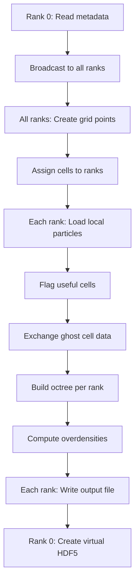

# MPI Parallelization

Complete guide to using the gridder with MPI for multi-node execution.

## Overview

The MPI build enables distributed memory parallelization across multiple compute nodes, allowing:

- Processing simulations larger than single-node memory
- Scaling to hundreds of cores
- Faster execution on HPC clusters

**Hybrid Approach:** MPI (inter-node) + OpenMP (intra-node threading)

## When to Use MPI

| Use Case | Recommendation |
|----------|----------------|
| Simulation < 10 GB | Single-node (OpenMP only) is simpler and often faster |
| Simulation 10-100 GB | MPI beneficial, especially if >16 cores needed |
| Simulation > 100 GB | MPI required (memory distribution essential) |
| Grid points > 10M | MPI helps distribute computation |
| Available cores > 16 | MPI + OpenMP hybrid scales better |

**Rule of thumb:** Use MPI when you need more than one node's worth of resources.

## Build for MPI

### Compilation

```bash
cmake -B build_mpi -DENABLE_MPI=ON -DCMAKE_BUILD_TYPE=Release
cmake --build build_mpi
```

This creates `build_mpi/parent_gridder` with MPI support.

**Verification:**

```bash
./build_mpi/parent_gridder --version | grep MPI
# Should show: MPI: Enabled (OpenMPI X.Y.Z)
```

## Execution

### Basic Usage

```bash
# Set OpenMP threads per rank
export OMP_NUM_THREADS=2

# Run with 4 MPI ranks
mpirun -n 4 ./build_mpi/parent_gridder params.yml 1 42
```

**Total cores used:** `num_ranks × OMP_NUM_THREADS`

Example: 4 ranks × 2 threads = 8 cores

### SLURM Batch Script

```bash
#!/bin/bash
#SBATCH --job-name=gridder
#SBATCH --nodes=2              # Number of nodes
#SBATCH --ntasks-per-node=16   # MPI ranks per node
#SBATCH --cpus-per-task=2      # OpenMP threads per rank
#SBATCH --time=02:00:00
#SBATCH --mem-per-cpu=4G

# Load modules
module load gcc/11.2
module load hdf5/1.12
module load openmpi/4.1

# Set OpenMP configuration
export OMP_NUM_THREADS=${SLURM_CPUS_PER_TASK}
export OMP_PROC_BIND=close
export OMP_PLACES=cores

# Total: 2 nodes × 16 ranks/node × 2 threads/rank = 64 cores
srun ./build_mpi/parent_gridder params.yml 1 ${SNAPSHOT}
```

### PBS/Torque Batch Script

```bash
#!/bin/bash
#PBS -N gridder
#PBS -l nodes=4:ppn=16
#PBS -l walltime=02:00:00

cd $PBS_O_WORKDIR

# Load modules
module load gcc/11.2
module load hdf5/1.12
module load openmpi/4.1

# 4 nodes × 16 cores/node = 64 total ranks
export OMP_NUM_THREADS=1
mpirun -np 64 ./build_mpi/parent_gridder params.yml 1 42
```

## MPI Workflow

### Domain Decomposition

The simulation volume is partitioned across MPI ranks using a **space-filling curve**:

```
┌─────────┬─────────┐
│ Rank 0  │ Rank 1  │  Top-level cells assigned
│  cells  │  cells  │  to ranks using Hilbert
├─────────┼─────────┤  curve for spatial locality
│ Rank 2  │ Rank 3  │
└─────────┴─────────┘
```

**Benefits:**

- Spatially local cells grouped together (better cache performance)
- Load balanced (approximately equal particles per rank)
- Minimizes inter-rank communication

### Execution Phases



**Key Points:**

1. **Metadata read once** - Only rank 0 reads, then broadcasts
2. **Particles read per-rank** - Each rank loads only its cells' particles
3. **Ghost cells** - Ranks exchange particles near boundaries
4. **Independent output** - Each rank writes its own HDF5 file
5. **Virtual file** - Rank 0 creates combined view

### Ghost Cells

Cells near rank boundaries need particles from neighboring ranks:

```
Rank 0        │  Rank 1
              │
   Cell A  ───┼──> Needs particles
   (needs     │     from Rank 1
    neighbor  │     for large kernels)
    data)     │
```

**Ghost Exchange Process:**

1. Identify cells within `max_kernel_radius` of boundaries
2. Flag as "proxy cells" on other ranks
3. Send/receive particle data for proxy cells
4. Use ghost particles for accurate kernel calculations

**Communication Pattern:** Point-to-point (each rank communicates only with neighbors)

## Output Files

### Per-Rank Files

Each MPI rank writes a separate HDF5 file:

```
output_directory/
├── gridded_data_rank0.hdf5
├── gridded_data_rank1.hdf5
├── gridded_data_rank2.hdf5
└── gridded_data_rank3.hdf5
```

**Contents:** Only the grid points and cells owned by that rank.

### Virtual File

Rank 0 creates a master file that combines all rank files:

```
gridded_data.hdf5  ← Virtual file (lightweight, no data duplication)
```

**Reading:**

```python
import h5py

# Read virtual file (appears as single dataset)
with h5py.File('gridded_data.hdf5', 'r') as f:
    # Automatically reads from all rank files
    overdens = f['Grids/Kernel_0/GridPointOverDensities'][:]
    positions = f['Grids/GridPointPositions'][:]
```

**Advantages:**

- No data duplication (virtual file is small)
- Transparent to users (looks like single file)
- Parallel I/O still possible with per-rank files

## Performance Optimization

### Rank Count Selection

**Strong Scaling (Fixed Problem Size):**

```bash
# 1M grid points, varying ranks
# 1 rank:   100s (baseline)
# 2 ranks:  55s  (1.8× speedup)
# 4 ranks:  30s  (3.3× speedup)
# 8 ranks:  18s  (5.6× speedup)
# 16 ranks: 12s  (8.3× speedup)
# 32 ranks: 10s  (10× speedup) ← diminishing returns
```

**Weak Scaling (Proportional Increase):**

```bash
# Scale grid points with ranks
# 1 rank,  1M points:   100s
# 2 ranks, 2M points:   105s  (similar time)
# 4 ranks, 4M points:   110s  (good scaling)
# 8 ranks, 8M points:   120s  (acceptable)
```

**Recommendations:**

- **Minimum:** ~100k grid points per rank (avoid over-decomposition)
- **Maximum:** Limited by communication overhead (~128-256 ranks)
- **Sweet spot:** 500k - 5M grid points per rank

### Thread Count per Rank

**Hybrid Configuration:**

```bash
# Node has 32 cores total
# Option 1: Many ranks, few threads
export OMP_NUM_THREADS=1
mpirun -n 32 ./parent_gridder params.yml 1

# Option 2: Balanced (usually best)
export OMP_NUM_THREADS=4
mpirun -n 8 ./parent_gridder params.yml 1

# Option 3: Few ranks, many threads
export OMP_NUM_THREADS=16
mpirun -n 2 ./parent_gridder params.yml 1
```

**General Rule:**

- **More ranks:** Better for I/O-bound, irregular workloads
- **More threads:** Better for compute-bound, regular workloads
- **Balanced:** 4-8 threads per rank often optimal

**Test on Your System:**

```bash
#!/bin/bash
# Benchmark different configurations
for NRANKS in 1 2 4 8 16; do
    NTHREADS=$((32 / NRANKS))
    export OMP_NUM_THREADS=$NTHREADS
    echo "Testing $NRANKS ranks × $NTHREADS threads"
    time mpirun -n $NRANKS ./parent_gridder params.yml 1
done
```

### I/O Optimization

**Chunked Reading:**

The gridder automatically optimizes particle I/O using chunked reads:

```yaml
# Control chunk merging (in metadata, not user-settable currently)
# gap_fill_fraction: 0.1  # Merge chunks if gap < 10% of total
```

**Future:** User control via parameter file.

**Performance Impact:**

- **Sparse grids:** May read some unused particles (acceptable overhead)
- **Dense grids:** Reads all particles anyway (no overhead)
- **Benefit:** 10-100× fewer HDF5 read operations

### Memory Management

**Per-Rank Memory:**

```
Memory = Simulation/N_ranks + Overhead
```

**Example:**

- Simulation: 40 GB
- 8 ranks: ~5 GB per rank + overhead
- Total cluster memory: 8 × (5 + 2) = 56 GB

**Overhead includes:**

- Octree structure (~20-30% of particle data)
- Grid points (~100 MB per million points)
- Ghost cells (~10-20% of particles)
- Communication buffers

**Rule of thumb:** Request 1.5× expected per-rank particle memory.

## Troubleshooting

??? failure "MPI_Init failed"

    **Error:**
    ```
    ORTE_ERROR_LOG: Not found
    ```

    **Cause:** MPI not properly initialized.

    **Solution:**

    1. Ensure MPI module is loaded:
       ```bash
       module load openmpi  # Or your MPI flavor
       ```

    2. Use `mpirun` or `srun`, not direct execution:
       ```bash
       # Wrong:
       ./build_mpi/parent_gridder params.yml 8

       # Right:
       mpirun -n 4 ./build_mpi/parent_gridder params.yml 1
       ```

??? failure "Ranks hanging at MPI_Barrier"

    **Symptom:** Program freezes, no output.

    **Cause:** Deadlock from mismatched MPI calls or errors on some ranks.

    **Debug:**

    ```bash
    # Run with high verbosity
    export OMP_NUM_THREADS=1
    mpirun -n 2 ./parent_gridder params.yml 1 0 2  # verbosity=2
    ```

    **Common causes:**

    - One rank encounters error, others wait forever
    - File I/O fails on some nodes
    - Different parameter files on different ranks

    **Solution:** Ensure all ranks can access all files.

??? failure "Output files not created"

    **Symptom:** Some rank files missing.

    **Cause:** Rank failed but didn't propagate error.

    **Debug:**

    ```bash
    # Check stderr from all ranks
    mpirun -n 4 ./parent_gridder params.yml 1 2>&1 | tee output.log
    grep -i error output.log
    ```

??? failure "Poor scaling / No speedup"

    **Symptom:** 4 ranks barely faster than 1 rank.

    **Causes:**

    1. **Too few grid points per rank:**
       ```yaml
       # Bad: 10k points ÷ 16 ranks = 625 points/rank
       Grid:
         cdim: 22  # Only 10,648 points total
       ```

       **Fix:** Use fewer ranks or more grid points.

    2. **Large kernels causing ghost overhead:**

       Check ghost cell fraction in output:
       ```
       [INFO] Ghost cells: 45% of total
       ```

       If >30%, consider:
       - Smaller kernels
       - Fewer ranks
       - Larger cells (higher `max_leaf_count`)

    3. **I/O bottleneck:**

       All ranks reading same file simultaneously. Use:
       - Lustre striping on HPC
       - Parallel filesystem (not NFS)

??? question "How many ranks should I use?"

    **Quick formula:**

    ```
    N_ranks ≈ GridPoints / 500,000
    N_ranks ≈ SimulationGB / 5
    ```

    Use the smaller of the two.

    **Example:**

    - 2M grid points, 20 GB simulation
    - By points: 2M / 500k = 4 ranks
    - By memory: 20 / 5 = 4 ranks
    - **Use:** 4 ranks

## Advanced MPI

### Custom MPI Launcher

Some systems use different launchers:

```bash
# OpenMPI
mpirun -n 4 ./parent_gridder params.yml 1

# Intel MPI
mpiexec -n 4 ./parent_gridder params.yml 1

# SLURM
srun -n 4 ./parent_gridder params.yml 1

# PBS/Torque
mpirun -np 4 ./parent_gridder params.yml 1
```

### Process Binding

**Bind ranks to cores:**

```bash
# OpenMPI
mpirun -n 4 --bind-to core ./parent_gridder params.yml 1

# With rank-to-core mapping
mpirun -n 4 --map-by core --bind-to core ./parent_gridder params.yml 1
```

**Benefits:**

- Prevents thread migration (better cache performance)
- Avoids hyperthreading (use physical cores)

### Network Optimization

**InfiniBand:**

```bash
# Force use of InfiniBand
export OMPI_MCA_btl=self,openib
mpirun -n 16 ./parent_gridder params.yml 1
```

**Ethernet:**

```bash
# Use TCP for communication
export OMPI_MCA_btl=self,tcp
mpirun -n 8 ./parent_gridder params.yml 1
```

### Debugging MPI Issues

**Verbose MPI output:**

```bash
# OpenMPI debug info
export OMPI_MCA_btl_base_verbose=30
mpirun -n 2 ./parent_gridder params.yml 1
```

**Attach debugger:**

```bash
# GDB on rank 0
mpirun -n 4 xterm -e gdb ./parent_gridder
```

**Valgrind with MPI:**

```bash
mpirun -n 2 valgrind --leak-check=full ./parent_gridder params.yml 1
```

## Performance Benchmarks

### Example: 50 Mpc/h Box, 100M Particles

| Configuration | Grid Points | Time | Memory/Rank |
|---------------|-------------|------|-------------|
| 1 rank × 16 threads | 1M | 180s | 8 GB |
| 4 ranks × 4 threads | 1M | 52s | 2.5 GB |
| 8 ranks × 2 threads | 1M | 30s | 1.5 GB |
| 16 ranks × 1 thread | 1M | 22s | 1 GB |

**Speedup:** ~8× from 1 to 16 ranks (good strong scaling)

### Example: Weak Scaling Test

| Ranks | Grid Points | Particles | Time | Efficiency |
|-------|-------------|-----------|------|------------|
| 1 | 1M | 100M | 180s | 100% |
| 2 | 2M | 200M | 190s | 95% |
| 4 | 4M | 400M | 200s | 90% |
| 8 | 8M | 800M | 220s | 82% |

**Result:** Good weak scaling up to 8 ranks, then communication overhead grows.

## See Also

- **[Installation](installation.md#multi-node-build-mpi--openmp-hybrid)** - Building with MPI
- **[Runtime Arguments](runtime-arguments.md)** - Command line options
- **[Parameters](parameters.md)** - Configuration reference
- **[Quickstart](quickstart.md)** - Basic examples
