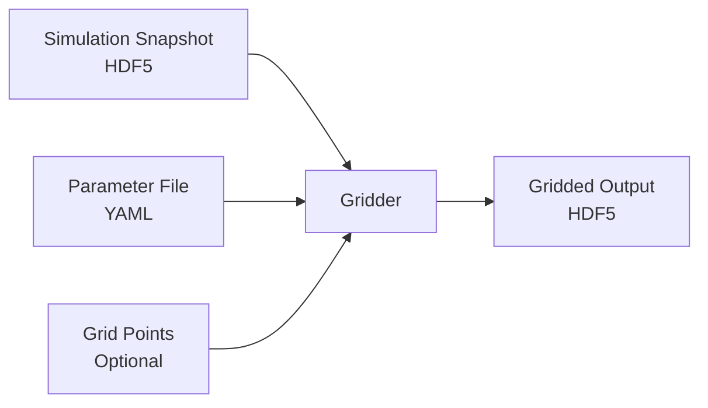

# Quickstart

Get up and running with the FLARES-2 Gridder in minutes.

## What is the Gridder?

The FLARES-2 Gridder is a high-performance C++ application that computes overdensities from cosmological simulations at specified grid points using spherical top hat kernels. It reads HDF5 snapshot files (primarily from SWIFT simulations) and outputs gridded overdensity fields.

## Basic Workflow



## Prerequisites

Before starting, ensure you have:

- Built the gridder (see [Installation](installation.md))
- Access to a SWIFT simulation snapshot (HDF5 format)
- Basic understanding of YAML syntax

## Minimal Example

### 1. Create a Parameter File

Create `params.yml` with minimal required parameters:

```yaml
Kernels:
  nkernels: 2
  kernel_radius_1: 0.5  # Mpc/h
  kernel_radius_2: 1.0  # Mpc/h

Grid:
  type: uniform
  cdim: 50  # 50^3 = 125,000 grid points

Tree:
  max_leaf_count: 200

Input:
  filepath: /path/to/snapshot_0042.hdf5

Output:
  filepath: ./output/
  basename: gridded_snapshot.hdf5
  write_masses: 0
```

### 2. Run the Gridder

=== "Single-Node (OpenMP)"

    ```bash
    # Use 8 OpenMP threads
    ./build/parent_gridder params.yml 8
    ```

=== "Multi-Node (MPI)"

    ```bash
    # 4 MPI ranks × 2 OpenMP threads = 8 cores total
    export OMP_NUM_THREADS=2
    mpirun -n 4 ./build_mpi/parent_gridder params.yml 1
    ```

### 3. Check the Output

The gridder creates `./output/gridded_snapshot.hdf5` with:

```
/Grids/
  ├── Kernel_0/
  │   └── GridPointOverDensities  # Overdensity for 0.5 Mpc/h kernel
  ├── Kernel_1/
  │   └── GridPointOverDensities  # Overdensity for 1.0 Mpc/h kernel
  └── GridPointPositions          # (x, y, z) coordinates
/Cells/
  ├── GridPointCounts             # Number of grid points per cell
  └── GridPointStart              # Starting index for each cell
/Header/                          # Metadata attributes
```

## Next Steps

- **[Installation](installation.md)** - Detailed installation instructions including MPI
- **[Parameters](parameters.md)** - Complete parameter reference
- **[Runtime Arguments](runtime-arguments.md)** - Command line options
- **[Gridding](gridding.md)** - Different grid types (uniform, random, file)
- **[MPI](mpi.md)** - Parallel execution on multiple nodes

## Common Use Cases

### High-Resolution Uniform Grid

For detailed density maps:

```yaml
Grid:
  type: uniform
  cdim: 200  # 8 million grid points
```

### Multi-Scale Analysis

Multiple kernel radii for scale-dependent analysis:

```yaml
Kernels:
  nkernels: 5
  kernel_radius_1: 0.25
  kernel_radius_2: 0.5
  kernel_radius_3: 1.0
  kernel_radius_4: 2.0
  kernel_radius_5: 4.0
```

### Random Sampling

For statistical analysis without regular grid artifacts:

```yaml
Grid:
  type: random
  n_grid_points: 1000000  # 1 million random points
```

### Custom Grid from File

For targeted regions or non-uniform sampling:

```yaml
Grid:
  type: file
  grid_file: /path/to/custom_grid_points.txt
```

Format of `custom_grid_points.txt`:
```
# x y z (one point per line, coordinates in simulation units)
5.0 5.0 5.0
10.2 15.3 20.1
# Comments start with #
25.0 30.0 35.0
```

## Performance Tips

!!! tip "Quick Performance Recommendations"
    - **OpenMP threads**: Set to number of physical cores (not hyperthreads)
    - **MPI ranks**: Use for simulations >10 GB or when needing >16 cores
    - **max_leaf_count**: 100-300 works well for most cases (lower = faster search, higher = less memory)
    - **Chunked I/O**: Automatic - just set `gap_fill_fraction` (0.05-0.2) for sparse grids

## Troubleshooting

??? question "Gridder crashes with 'out of memory'"
    - Reduce grid resolution (`cdim`) or number of grid points
    - Increase `max_leaf_count` (reduces tree depth, saves memory)
    - Use MPI to distribute memory across nodes

??? question "Slow runtime"
    - Increase OpenMP threads (up to physical core count)
    - Check if using MPI build when you don't need it (serial is faster for small jobs)
    - Verify `max_leaf_count` is reasonable (100-300)

??? question "All overdensities are -1"
    - Check that simulation particles are loaded correctly
    - Verify grid points are within simulation box boundaries
    - Ensure kernel radii are appropriate for your simulation resolution

??? question "Output file not created"
    - Check `Output/filepath` directory exists
    - Verify write permissions
    - Look for error messages about grid points (might be 0 grid points)
